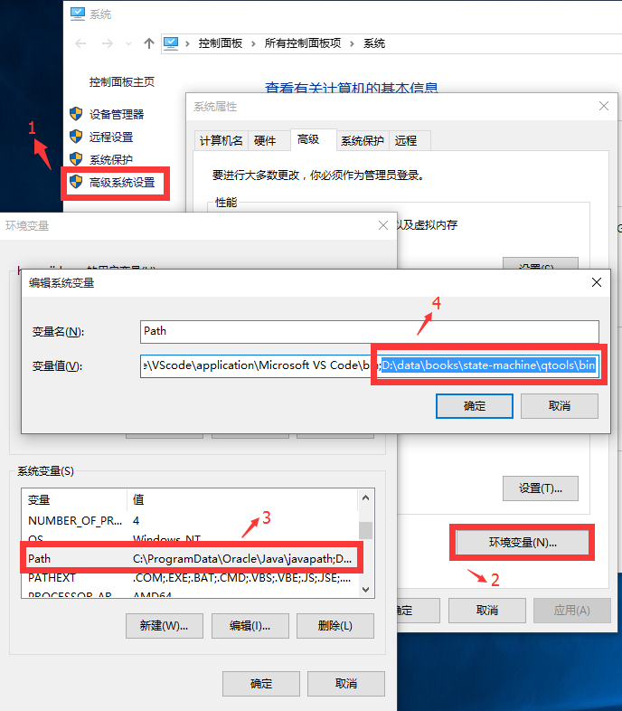
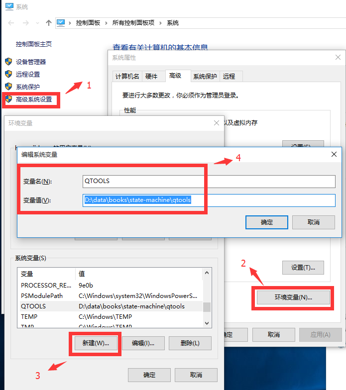
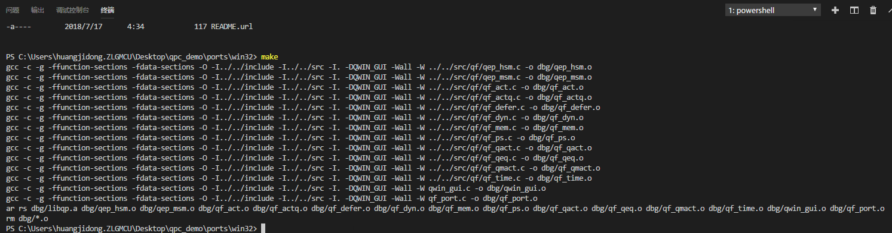
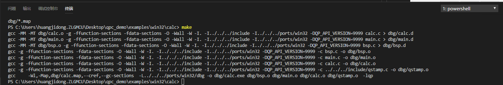
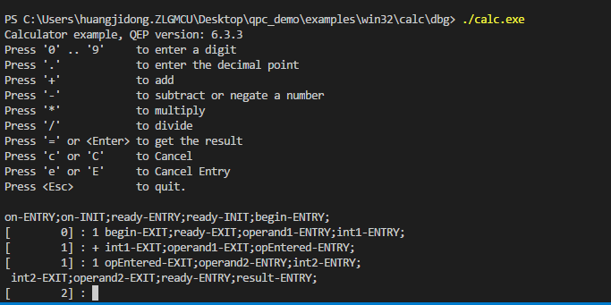

# 1、背景简介

QP、QM、QP/Spy产自Quantum Leaps,LLC公司（是一家North Carolina的现代嵌入式实时软件开发商）

- 官网：www.state-machine.com
- QP：状态机 + RTOS编程框架
- QM：图形编程，自动生成代码
- QP/spy：代码追踪
- license：dual licensing（http://oss-watch.ac.uk/resources/duallicence2）

# 2、windows下运行QP/C的examples

1. 下载qp/c（https://www.state-machine.com/products/）
2. 下载Qtools（用于编译在win下运行的qp/c examples）
3. 配置win的PATH环境变量，将Qtools/bin路径添加进去，Qtools的bin路径下集成了MinGW的make和gcc等工具，所以可以用于生成qp库和生成example的exe文件，从“\qpc软件包\examples\win32\README.txt”获知要这样做。

    

4. 增加win的环境变量QTOOLS，变量值是qtools工具的路径，因为examples的makefile中需要用到这个环境变量，如果不添加，make对应example时候会报错，从“\qpc软件包\examples\win32\README.txt”获知要这样做。

    

5. 进入ports文件夹生成libqp.a库，如果不生成这个库，将会无法编译examples，这个库的作用从“\qpc软件包\examples\win32\README.txt”获知。这里的make实际调用了第3步设置的"qtools/bin/make"

    

6. 进入samples目录，到win32下的calc编译出exe文件。

    

7. exe生成在samples的dbg文件下，可以去运行试一下。

    
